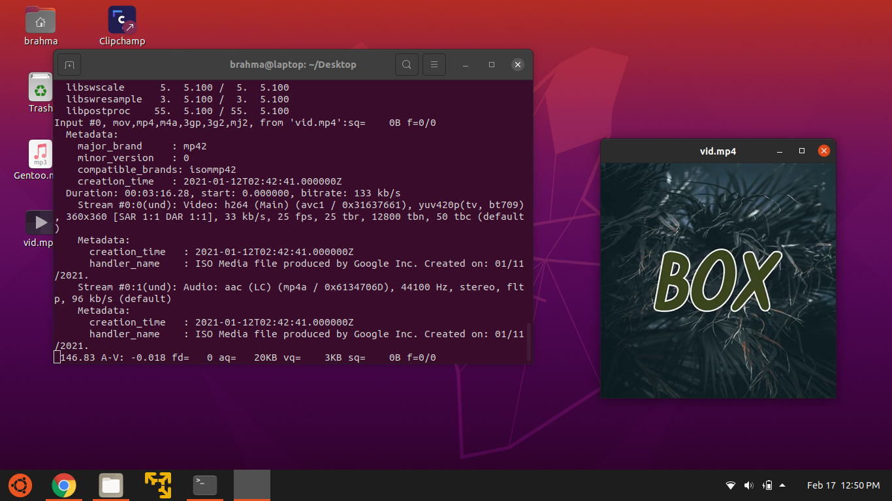

# GetYT
A (frontend) to `youtube-dl`.



## How it works:

First, it grabs the video using `youtube-dl`.

Then, it displays the video using `ffplay`. It's included in `ffmpeg`.

After that, it deletes the video.

## Compiling
Well, if you are on Debian, then run:
```bash
dpkg-deb -b .
mv -f ..deb GETYT.deb
sudo dpkg -i GETYT.deb
sudo rm /.gitignore /README.md /LICENSE /Screenshot.png /usr/.gitignore /usr/README.md /usr/LICENSE /usr/Sreenshot.png /GETYT.deb /usr/GETYT.deb /..deb /usr/..deb
```
If you are not on Debian, then run:
```bash
sudo cp -f bin/getyt /usr/local/bin
sudo chmod +x /usr/local/bin/getyt
```
That's it!
